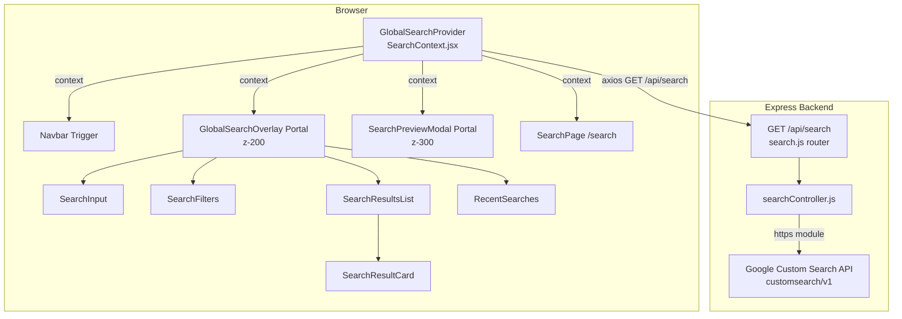

# Design Document: Global Search

## Overview

The Global Search feature adds a platform-wide web search capability to TabTrack. Students can trigger a floating search overlay from anywhere in the app using `Ctrl+G` / `Ctrl+K` (or a Navbar button), query the real web via a backend proxy to the Google Custom Search API, filter results by category, preview pages in an iframe modal, and revisit recent searches — all without leaving the platform or interrupting an active study room session.

The design is built around three principles:

1. **Zero interference with existing features** — the overlay is a React Portal; Room.jsx, WebRTC, Socket.IO, and Monaco are completely unaffected.
2. **Credential security** — API keys never leave the server; the frontend only ever talks to `/api/search`.
3. **No new dependencies** — the backend uses Node's built-in `https` module; the frontend uses the already-installed `axios`.

---

## Architecture



**Data flow for a search:**

1. User presses `Ctrl+G` → `GlobalSearchProvider` sets `isOpen = true`.
2. User types a query and selects a filter → `search(query, filter)` is called.
3. Provider calls `GET /api/search?q=<query>&filter=<filter>` via axios.
4. Express controller builds the Google CSE URL (appending the site restriction for the filter), calls Google CSE using Node `https`, maps the response to the standard shape, and returns it.
5. Provider stores `results` in context state; overlay re-renders with `SearchResultCard` components.
6. User clicks a card → `openPreview(link)` → `SearchPreviewModal` renders an iframe.

---

## Components and Interfaces

### Backend

#### `Backend/src/routes/search.js`

```
GET /api/search
  Query params:
    q      (string, required, non-empty)
    filter (string, optional, default: "all")
  Response 200:
    { results: SearchResult[], error: null }
  Response 400:
    { results: [], error: "Query parameter 'q' is required and must be non-empty." }
  Response 502:
    { results: [], error: "<descriptive message>" }
```

Mounted in `app.js` as:
```js
app.use("/api/search", searchRouter);
```

#### `Backend/src/controllers/searchController.js`

Responsibilities:
- Validate `q` (reject if absent or empty string after trim).
- Look up the site restriction string from the filter map.
- Build the Google CSE URL using `GOOGLE_SEARCH_API_KEY` and `GOOGLE_SEARCH_ENGINE_ID` from `process.env`.
- Make the HTTPS request using Node's built-in `https` module (no new npm packages).
- Map each Google CSE item to `{ title, snippet, link, displayLink, thumbnail, favicon }`.
- Return the standard response shape.

**Filter map:**

| Filter value    | Site restriction appended to query                          |
|-----------------|-------------------------------------------------------------|
| `all` / omitted | *(none)*                                                    |
| `docs`          | `site:developer.mozilla.org OR site:docs.python.org`        |
| `youtube`       | `site:youtube.com`                                          |
| `stackoverflow` | `site:stackoverflow.com`                                    |
| `geeksforgeeks` | `site:geeksforgeeks.org`                                    |
| `mdn`           | `site:developer.mozilla.org`                                |
| `research`      | `site:arxiv.org OR site:scholar.google.com`                 |

**Field mapping from Google CSE item:**

| Output field  | Source in Google CSE item                                                    |
|---------------|------------------------------------------------------------------------------|
| `title`       | `item.title`                                                                 |
| `snippet`     | `item.snippet`                                                               |
| `link`        | `item.link`                                                                  |
| `displayLink` | `item.displayLink`                                                           |
| `thumbnail`   | `item.pagemap?.cse_thumbnail?.[0]?.src ?? null`                              |
| `favicon`     | `https://www.google.com/s2/favicons?domain=${item.displayLink}&sz=32`        |

---

### Frontend

#### `Frontend/src/context/SearchContext.jsx`

Exports `GlobalSearchProvider` and `useSearch` hook.

**State shape:**

```ts
{
  isOpen: boolean,           // overlay visibility
  query: string,             // current input value
  results: SearchResult[],   // current result set
  loading: boolean,          // request in flight
  error: string | null,      // API error message
  activeFilter: string,      // "all" | "docs" | "youtube" | ...
  selectedIndex: number,     // keyboard-highlighted result (-1 = none)
  previewUrl: string | null, // URL loaded in Preview_Modal
  recentSearches: string[],  // from localStorage
  focusWarningDismissed: boolean // per-session dismiss flag
}
```

**Exposed context functions:**

| Function                  | Description                                                                 |
|---------------------------|-----------------------------------------------------------------------------|
| `openSearch()`            | Sets `isOpen = true`                                                        |
| `closeSearch()`           | Resets `results`, `loading`, `error`, `selectedIndex`, `previewUrl`; sets `isOpen = false` |
| `search(query, filter)`   | Calls `/api/search`, updates `results`/`loading`/`error`; saves to recent  |
| `setQuery(q)`             | Updates `query` field                                                       |
| `setFilter(f)`            | Updates `activeFilter`; re-runs search if query is non-empty                |
| `openPreview(url)`        | Sets `previewUrl = url`                                                     |
| `closePreview()`          | Sets `previewUrl = null`                                                    |
| `clearRecent()`           | Empties `recentSearches`, updates localStorage                              |
| `removeRecent(entry)`     | Removes one entry from `recentSearches`, updates localStorage               |

**Keyboard listener (registered once on `document`):**

```
Ctrl+G / Ctrl+K  → if activeElement is not INPUT/TEXTAREA/[data-keybinding-context]: openSearch(), preventDefault()
Escape           → if isOpen: closeSearch()
ArrowDown        → if isOpen && results.length: selectedIndex = (selectedIndex + 1) % results.length
ArrowUp          → if isOpen && results.length: selectedIndex = (selectedIndex - 1 + results.length) % results.length
Enter            → if isOpen && selectedIndex >= 0: openPreview(results[selectedIndex].link)
```

---

#### Component Tree

```
GlobalSearchProvider (SearchContext.jsx)
├── [App tree — BrowserRouter, Redux Provider, all routes]
├── GlobalSearchOverlay (Portal → document.body, z-[200])
│   ├── SearchInput (h-14, auto-focus)
│   ├── SearchFilters (filter pills)
│   ├── RecentSearches (shown when query is empty)
│   ├── FocusModeWarning (shown when in /room/* with off-topic query)
│   └── SearchResultsList (max-h-[55vh], scrollable)
│       └── SearchResultCard (×N)
└── SearchPreviewModal (Portal → document.body, z-[300])
```

#### `GlobalSearchOverlay.jsx`

- Rendered via `ReactDOM.createPortal(…, document.body)`.
- Backdrop: `fixed inset-0 bg-black/50 backdrop-blur-sm z-[200]`.
- Panel: centered, `max-w-[680px]`, `top-[15%]`, `glass backdrop-blur-2xl`.
- Animation: `scale` + `opacity` transition, `duration-150 ease`.
- Footer hint: `↑↓ navigate  ↵ open  Esc close`.

#### `SearchInput.jsx`

- `h-14`, search icon on left, clear (×) button on right when query is non-empty.
- `autoFocus` when overlay opens.
- Debounce: 300ms before triggering `search()`.

#### `SearchFilters.jsx`

- Pills: All · Docs · YouTube · Stack Overflow · GeeksforGeeks · MDN · Research.
- Active pill: highlighted with `bg-primary/20 border-primary/50 text-primary`.
- Clicking a pill calls `setFilter(value)`.

#### `SearchResultsList.jsx`

- `overflow-y-auto max-h-[55vh]`.
- States: loading (skeleton cards), empty (empty-state message), error (error-state message), results (list of `SearchResultCard`).

#### `SearchResultCard.jsx`

- Layout: favicon (32×32, fallback icon on error) | title + displayLink + snippet | optional thumbnail (right side).
- Selected state (via `selectedIndex`): `bg-white/10 ring-1 ring-primary/50`.
- Click → `openPreview(result.link)`.

#### `RecentSearches.jsx`

- Shown when `query === ""` and `recentSearches.length > 0`.
- Each entry: clock icon + text + ✕ button.
- "Clear all" button at top-right.
- Click on entry → `setQuery(entry)` + `search(entry, activeFilter)`.
- localStorage key: `tabtrack_recent_searches`, max 10, deduplicated case-insensitively (duplicate moves to front).

#### `SearchPreviewModal.jsx`

- `ReactDOM.createPortal(…, document.body)`, `fixed inset-0 z-[300]`.
- Header bar: back button | read-only URL bar | "Open in new tab" button | close button.
- Body: `<iframe src={previewUrl} className="w-full h-full border-0" />`.
- X-Frame-Options fallback: catch `load` event where `iframe.contentDocument` is inaccessible → show "This site can't be previewed. Open in new tab?" with a button.

#### `SearchPage.jsx` (`/search` route)

- Reads `q` and `filter` from `useSearchParams()` on mount; calls `search()` if `q` is present.
- `useEffect` on `[searchParams]` to re-run on browser back/forward.
- On new search: calls `setSearchParams({ q, filter })` to keep URL in sync.
- Layout: `grid grid-cols-1 md:grid-cols-2 gap-4`.
- Renders same filter pills, loading, empty, and error states as the overlay.

---

### Modified Files

#### `Frontend/src/App.jsx`

```jsx
// Wrap everything with GlobalSearchProvider (outside Redux Provider)
// Add /search route inside Body layout
// Mount GlobalSearchOverlay and SearchPreviewModal outside BrowserRouter
<GlobalSearchProvider>
  <Provider store={appStore}>
    <BrowserRouter>
      <Routes>
        <Route path="/" element={<Body />}>
          {/* existing routes */}
          <Route path="search" element={<SearchPage />} />
        </Route>
      </Routes>
    </BrowserRouter>
    <GlobalSearchOverlay />
    <SearchPreviewModal />
  </Provider>
</GlobalSearchProvider>
```

> Note: `GlobalSearchOverlay` and `SearchPreviewModal` are placed outside `BrowserRouter` but inside `GlobalSearchProvider` so they have access to context. They use portals so they render into `document.body` regardless of DOM position.

#### `Frontend/src/Components/Navbar.jsx`

Replace:
```jsx
<div className="hidden md:block w-[220px]">
  <Input placeholder="Search…" />
</div>
```

With:
```jsx
<div className="hidden md:block w-[220px]">
  <button
    onClick={openSearch}
    className="w-full h-9 flex items-center gap-2 px-3 rounded-xl
               glass border border-white/10 text-mutedForeground
               hover:bg-white/5 transition text-sm"
  >
    <SearchIcon className="h-4 w-4 shrink-0" />
    <span className="flex-1 text-left">Search…</span>
    <kbd className="text-[10px] bg-white/10 px-1.5 py-0.5 rounded-md">Ctrl+G</kbd>
  </button>
</div>
```

Add to dropdown menu (before the logout button):
```jsx
<button onClick={() => { openSearch(); setOpen(false); }}
  className="block w-full text-left px-4 py-3 text-sm hover:bg-white/5 transition">
  Search
</button>
```

---

## Data Models

### `SearchResult` (shared shape between backend response and frontend state)

```ts
interface SearchResult {
  title: string;        // page title
  snippet: string;      // text excerpt
  link: string;         // canonical URL (never mutated by frontend)
  displayLink: string;  // human-readable domain
  thumbnail: string | null; // image URL or null
  favicon: string;      // Google favicon service URL
}
```

### API Response Envelope

```ts
interface SearchApiResponse {
  results: SearchResult[];
  error: string | null;
}
```

### `localStorage` Schema

```
key:   "tabtrack_recent_searches"
value: JSON.stringify(string[])   // max 10 entries, most-recent-first, case-insensitive dedup
```

### Environment Variables (backend only)

```
GOOGLE_SEARCH_API_KEY    — Google Custom Search API key
GOOGLE_SEARCH_ENGINE_ID  — Custom Search Engine ID (cx parameter)
```

These are read exclusively from `process.env` inside `searchController.js` and are never included in any HTTP response.

---

## Correctness Properties

*A property is a characteristic or behavior that should hold true across all valid executions of a system — essentially, a formal statement about what the system should do. Properties serve as the bridge between human-readable specifications and machine-verifiable correctness guarantees.*

---

### Property 1: Filter map produces correct site restriction

*For any* valid filter value (`all`, `docs`, `youtube`, `stackoverflow`, `geeksforgeeks`, `mdn`, `research`), the Google CSE query string constructed by the controller SHALL contain exactly the site restriction string defined in the filter map for that filter, and no other site restriction.

**Validates: Requirements 1.4, 1.5, 1.6, 1.7, 1.8, 1.9, 1.10**

---

### Property 2: Response shape completeness

*For any* Google CSE response containing one or more items, every element in the mapped `results` array SHALL contain non-null values for `title`, `snippet`, `link`, `displayLink`, and `favicon`, and a value (string or null) for `thumbnail`.

**Validates: Requirements 1.11, 11.3**

---

### Property 3: API credentials never leak

*For any* request to `GET /api/search` (valid, invalid, or error-inducing), the HTTP response body string SHALL NOT contain the value of `GOOGLE_SEARCH_API_KEY` or `GOOGLE_SEARCH_ENGINE_ID`.

**Validates: Requirements 1.3**

---

### Property 4: closeSearch resets transient state while preserving persistent state

*For any* Search_Provider state configuration (arbitrary `results`, `loading`, `error`, `selectedIndex`, `previewUrl`, `recentSearches`, `activeFilter`), calling `closeSearch()` SHALL set `results` to `[]`, `loading` to `false`, `error` to `null`, `selectedIndex` to `-1`, and `previewUrl` to `null`, while leaving `recentSearches` and `activeFilter` unchanged.

**Validates: Requirements 2.5**

---

### Property 5: Keyboard guard prevents overlay opening in editor context

*For any* element that is an `<input>`, `<textarea>`, or has the attribute `[data-keybinding-context]`, pressing `Ctrl+G` or `Ctrl+K` while that element is focused SHALL NOT change `isOpen` from `false` to `true`.

**Validates: Requirements 3.1, 3.7**

---

### Property 6: Arrow key navigation wraps correctly

*For any* results array of length N (N ≥ 1) and any starting `selectedIndex` value in `[0, N-1]`, pressing `ArrowDown` SHALL produce `(selectedIndex + 1) % N`, and pressing `ArrowUp` SHALL produce `(selectedIndex - 1 + N) % N`.

**Validates: Requirements 3.3, 3.4**

---

### Property 7: Result card renders all required fields

*For any* `SearchResult` object with non-empty `title`, `snippet`, `displayLink`, and `favicon`, the rendered `SearchResultCard` SHALL display the `title`, `displayLink`, and `snippet` in its output, and SHALL render an image element for the favicon.

**Validates: Requirements 5.1, 5.2**

---

### Property 8: Recent searches list never exceeds 10 entries

*For any* sequence of search queries of length greater than 10, the `recentSearches` array stored in `localStorage` SHALL have a length of at most 10 after all queries are processed.

**Validates: Requirements 6.2**

---

### Property 9: Recent searches deduplication (case-insensitive)

*For any* sequence of search queries containing a repeated query string (case-insensitively equal), the `recentSearches` array SHALL contain that query string exactly once, positioned at index 0 (most recent).

**Validates: Requirements 6.3**

---

### Property 10: Recent searches localStorage round-trip

*For any* array of search strings stored under `tabtrack_recent_searches`, serializing to `localStorage` via `JSON.stringify` and then deserializing via `JSON.parse` SHALL produce an array that is element-wise equal to the original.

**Validates: Requirements 6.1, 11.4**

---

### Property 11: Search page URL round-trip

*For any* non-empty query string `q` and valid filter value `f`, executing a search on the Search_Page SHALL update the URL search parameters so that `searchParams.get("q") === q` and `searchParams.get("filter") === f`.

**Validates: Requirements 8.4**

---

### Property 12: Focus mode warning shown iff query is off-topic in a room

*For any* query string that does not contain any of the study-related keywords, when the current pathname contains `/room/` and `results.length > 0`, the Focus_Mode_Warning SHALL be visible. *For any* query string that contains at least one study-related keyword, the Focus_Mode_Warning SHALL NOT be visible regardless of pathname.

**Validates: Requirements 10.1**

---

### Property 13: Results count preserved end-to-end

*For any* Search_API response containing N result items, the `results` array in Search_Provider state after the request completes SHALL have exactly N elements.

**Validates: Requirements 11.1**

---

### Property 14: Result links are never mutated

*For any* result object returned by the Search_API, the `link` field stored in Search_Provider state SHALL be strictly equal (===) to the `link` field in the API response, with no transformation applied.

**Validates: Requirements 11.2**

---

## Error Handling

### Backend

| Scenario                          | HTTP Status | Response body                                      |
|-----------------------------------|-------------|----------------------------------------------------|
| `q` absent or empty               | 400         | `{ results: [], error: "Query parameter 'q' is required and must be non-empty." }` |
| Unknown `filter` value            | 400         | `{ results: [], error: "Invalid filter value." }`  |
| Google CSE returns non-2xx        | 502         | `{ results: [], error: "Search service returned an error: <status>." }` |
| Google CSE unreachable / timeout  | 502         | `{ results: [], error: "Search service is unreachable." }` |
| Google CSE returns empty items    | 200         | `{ results: [], error: null }`                     |

The controller wraps the `https.get` call in a try/catch and always returns the standard envelope. `GOOGLE_SEARCH_API_KEY` and `GOOGLE_SEARCH_ENGINE_ID` are never included in error messages.

### Frontend

| Scenario                          | UI behavior                                                  |
|-----------------------------------|--------------------------------------------------------------|
| `loading === true`                | Skeleton cards replace result list                           |
| `error !== null`                  | Error state message shown in results area                    |
| `results.length === 0` (no error) | Empty state message shown                                    |
| Favicon image fails to load       | `onError` replaces `` with a generic globe icon         |
| iframe blocked by X-Frame-Options | Fallback message with "Open in new tab" button               |
| `closeSearch` called mid-request  | `loading` reset to `false`; stale response ignored via abort flag |

---

## Testing Strategy

### Unit Tests (example-based)

Focus on specific behaviors and edge cases:

- `searchController`: 400 on missing `q`, 400 on empty `q`, 502 on Google CSE error, correct filter map lookup for each filter value, correct field mapping from a mock CSE item.
- `SearchContext`: initial state shape, `closeSearch` resets correct fields, `openSearch` sets `isOpen`, `removeRecent` removes correct entry, `clearRecent` empties array.
- `SearchResultCard`: renders title/snippet/displayLink, renders thumbnail when present, hides thumbnail when null, applies selected style when `selectedIndex` matches.
- `RecentSearches`: renders entries, clicking entry triggers search, ✕ removes entry, "Clear all" empties list.
- `SearchPreviewModal`: renders iframe with correct src, "Open in new tab" opens new tab, close button calls `closePreview`.
- `Navbar`: trigger button renders with correct text and badge, click calls `openSearch`.

### Property-Based Tests

Use **fast-check** (JavaScript) for all property tests. Each test runs a minimum of **100 iterations**.

Tag format: `// Feature: global-search, Property <N>: <property_text>`

| Property | Test description                                                                 |
|----------|----------------------------------------------------------------------------------|
| P1       | Arbitrary filter value → outgoing URL contains correct site restriction          |
| P2       | Arbitrary CSE response items → all mapped results have required fields           |
| P3       | Arbitrary request → response body string does not contain API key or engine ID   |
| P4       | Arbitrary state → `closeSearch()` resets transient fields, preserves persistent  |
| P5       | Arbitrary focused element type → keyboard guard blocks/allows correctly          |
| P6       | Arbitrary N and selectedIndex → ArrowDown/Up wraps correctly                     |
| P7       | Arbitrary SearchResult → rendered card contains all required fields              |
| P8       | Arbitrary long query sequence → recentSearches.length ≤ 10                      |
| P9       | Arbitrary sequence with duplicates → recentSearches has no duplicates            |
| P10      | Arbitrary string array → localStorage round-trip produces equivalent array       |
| P11      | Arbitrary q and filter → URL params match after search                           |
| P12      | Arbitrary query → focus warning visibility matches keyword presence              |
| P13      | Arbitrary N-item API response → state.results.length === N                       |
| P14      | Arbitrary result objects → state link === API link (no mutation)                 |

### Integration Tests

- `GET /api/search` route is reachable and returns the standard envelope shape (smoke test for route mounting).
- With a mocked Google CSE response, the full request-response cycle produces the correct JSON shape.
- `GlobalSearchProvider` is accessible from components rendered inside the Redux `Provider` (context availability smoke test).

### Testing Notes

- Backend property tests mock the `https` module to avoid real network calls and keep tests fast.
- Frontend property tests use `@testing-library/react` with a mock `SearchContext` value.
- No new npm packages are introduced for testing beyond what the project already uses or the standard `fast-check` library for PBT.
